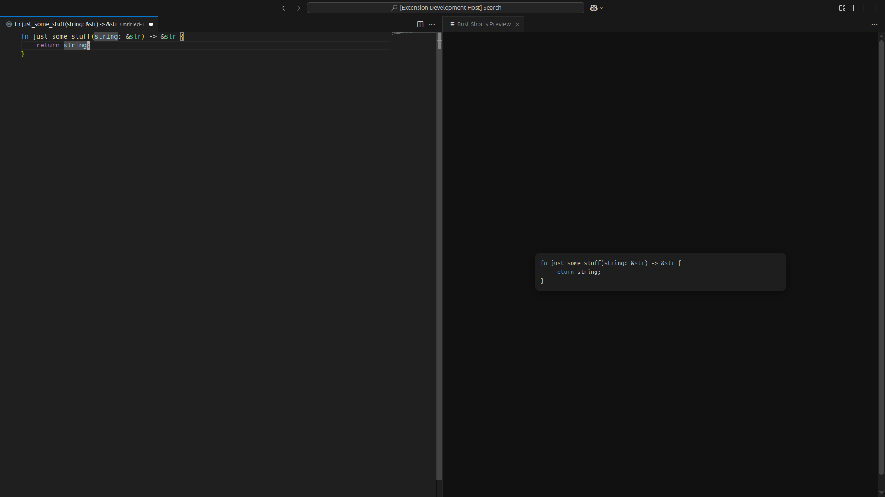

# reelrender

**reelrender** is a Visual Studio Code extension that lets you create a **stylized, vertical preview of your Rust code**, perfect for creating content for **YouTube Shorts**, **Instagram Reels**, or other vertical video formats. It displays your code in a **narrow 9:16 layout** with syntax highlighting via Prism.js, automatically wrapping long lines so your code fits neatly into the preview panel.

---

## Features

- **Live Rust Preview** – See your currently active Rust file rendered in a vertical preview panel.  
- **Syntax Highlighting** – Powered by Prism.js, supporting Rust syntax out of the box.  
- **Line Wrapping** – Long lines automatically wrap instead of scrolling horizontally.  
- **Customizable Themes** – Easily switch Prism.js themes or include your own CSS.  
- **9:16 Layout** – Ideal for vertical content creation; perfect for recording with OBS or other screen capture software.  

  

> Tip: Resize the preview panel in VS Code to match your preferred vertical format for Shorts/Reels.  

---

## Requirements

- Visual Studio Code (latest stable version recommended)  
- Active Rust file in the editor (`.rs` extension)  

Optional: For recording videos, OBS or any screen capture software.

---

## Extension Settings

Currently, **reelrender** does not require additional settings, but you can customize the Prism.js theme by adding your own CSS file in the `media` folder and referencing it in the extension code.

---

## Known Issues

- Only supports Rust files (`.rs`) for syntax highlighting.  
- Custom CSS changes require a reload of the preview panel.  
- Live updates may lag slightly for extremely large files.  

---

## Release Notes

### 0.0.1
Initial release of **reelrender**:
- Live Rust preview panel
- Prism.js syntax highlighting
- 9:16 vertical layout with line wrapping

---

**Enjoy stylized Rust previews for your Shorts/Reels!**
